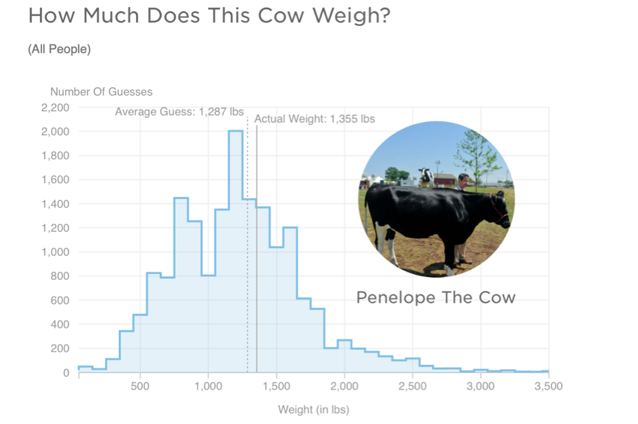
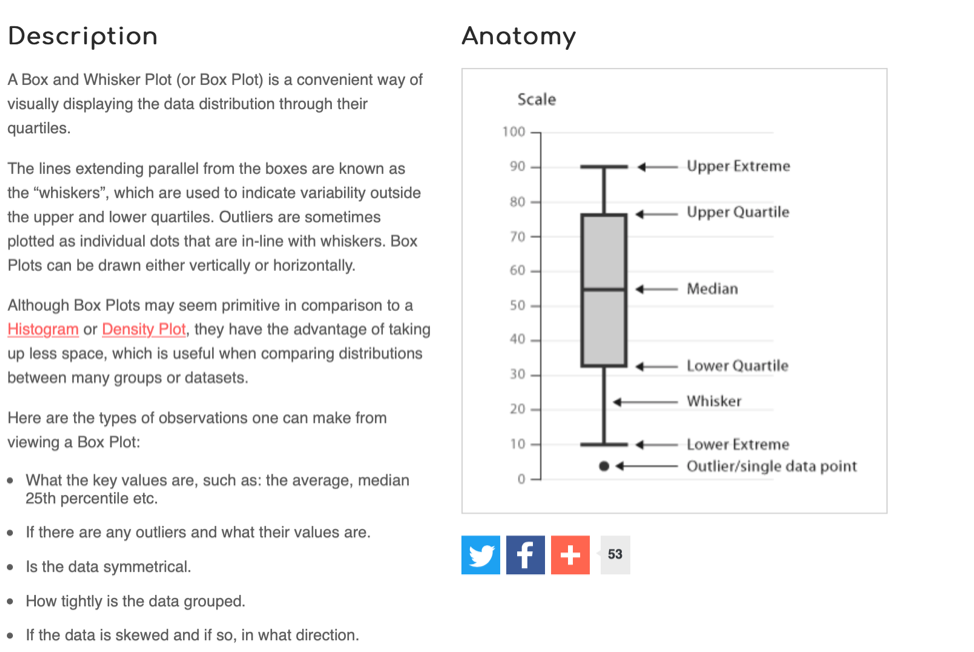

---
output:
  html_document: default
  pdf_document: default
---

# Week 2: Descriptive statistics in R Studio\*

> Written by John Towse & Tom Beesley

## Pre-lab work

Last week we asked you to

-   Practice a WBA task (the math skill task)
-   Connect to the R Studio server and enter some simple commands
-   Complete a survey so that we can collect data for analysis teaching

This week - we are introducing the **`learnr`** tutorial system for lab preparation. This will allow you to try out some useful lab skills before your main lab.

**Please make sure you've looked at and followed through the exercises here: <https://ma-rconnect.lancs.ac.uk/PSYC121_W2_labprep/>**

### File organisation

We also recommend that you set up your University "H drive" by following [the instructions here](https://answers.lancaster.ac.uk/display/ISS/Personal+filestore+%28H+drive%29+help)

If you do this, you can organise your files in one place and access them from any university computer that you log in to, including the lab machines in the Levy Lab and the virtual machine (see above). So this effectively acts as a free, cloud-based storage solution for your work (and even personal stuff).

However you choose to store your files, it's essential that you are careful about file organisation. As you progress through these exercises, you will find yourself downloading many data files, and creating many R scripts.

Consider each week a new set of materials that should have it's own folder. Get used to organising your work and you will be well placed to revise the material at a later date.

### R Studio tasks

For a reminder of how to start R Studio, see the [Week 1 content](#getting_started).

You can access the RStudio Server at: <http://psy-rstudio.lancaster.ac.uk/> 

(remember: off campus, you will need to be on the VPN)

### Bringing data, scripts and files into R Studio

In week 1, we had a tiny dataset that we entered into R through command line. We're going to need a way to tell R about bigger datasets though, so we need to work with datafiles, and bring them into R so that they can form data frames and other forms of data objects in R.

We've provided (on moodle) a walk-though of how to get a data file (in a zip compressed file) into the R environment. Note, once we have imported it into R, it's no longer the original file started with, but within R is has become a named data frame.

## Lab exercises

### Descriptive information in R Studio

Some 5 years ago, a large group of participants gave an estimate of the weight of Penelope the cow. Just over 17,000 guesses. And the distribution of guesses was something like this: 

What we can see from this graph is that:

1.  Guesses formed a roughly normal distribution. There is a bit of a skew with a right-hand tail, but this is inevitable as a weight of less than 0 is physically impossible, but there is no limit of the semantics of a large guess.
2.  The mean guess weight (1,287 lbs) is very close to the actual (true) weight of the cow (1,355 lbs). So even though lots of people were inaccurate, a central tendency measure has a pretty good alignment with te true weight. This is known as the Wisdom of Crowds phenomenon, first identified by Galton in 1907 (though he suggested using the median weight)

Let's look at (a smaple of) the PSYC121 student data from 2021 collected on guessing the weight of Penelope, and ask whether it resembles the properties of this large dataset.

### Loading the data {#uploading_zip}

To get the data into R Studio, you need to complete the following steps:

1. Download the "zip" file by [clicking this link](files/Week_2/Week_2.zip)
2. Find the location of the file on your computer and check it is saved as a ".zip" file
3. Return to RStudio and navigate to the folder you want to upload the data into (you could create a new folder for this week).
4. Click "Upload"
5. Check the target directory is correct
6. Click choose file and find the file on your computer. 
7. Select the file and click "Open". Click "OK"

You should now see the files extracted in the directory. If you receive an "unexpected server error" please try this process in a different browser. If you still have trouble, send your username to us [t.beesley\@lancaster.ac.uk](mailto:t.beesley@lancaster.ac.uk){.email} for support.

### Using the R script {#basic_script}

Let's start working with our data, by opening up the "Week_2_script.R" file. It's part of the zip file for week 2. This is an "R script" that contains a series of commands. We could type each of these in the console window (like we did in Week 1), but by having them in a script like this, it saves us typing them or copying and pasting them into the console. It also means we have a record of all the commands we have run.

The first command is to load a library of functions:


```r
library(tidyverse)
```

To run this, simply click anywhere on line 1 of the R script to put the cursor there, and press ctrl+enter (cmd+enter on a mac) or click the button called run. You will see a number of messages appear in the console. Don't worry about these, or worry too much about what exactly this command is doing. Essentially this is giving us some useful tools for our analysis. We will introduce the features of the **tidyverse** gradually during this course.

(side note: If you were using a local version of R studio on your computer, it might not have the 'tidyverse' library already installed. You would need to install the package first)

To import the data into RStudio, from the csv file, simply click the "Import Dataset" button in the "Enviornment" pane. John has [a video available](https://dtu-panopto.lancs.ac.uk/Panopto/Pages/Viewer.aspx?id=646a4bd4-9b2e-46a1-b2ee-adc100ce507b) to follow along with, if you have trouble with this bit.

The data are in R studio if you have followed all the lab sheet to this point. Note that when you imported the data into the R environment, a command line was generated at the console


```r
 penelope21 <- read.csv("~/penelope21.csv")
```

What this command accomplished was to read the spreadsheet called 'penelope21' into an object in R called penelope21. You could use any object label, but it's important to then keep that name consistent in what you do next.

The command was also generated


```r
 View(penelope21)
```

which presents the data in a windo of R studio. Note that "NA" means not available or missing data. Does this file structure make some sense to you?

### Finding the mean and median estimates

Use the data to answer the following questions...

1.  What is the mean weight estimates?
2.  What is the standard deviation of the estimates?
3.  What is the median weight of the estimates?
4.  Which of these central tendency measures is the more accurate measure of the true cow weight? (make a judgement)
5.  What is the mean weight estimate (and standard deviation) for female respondents and non-female (male / non-binary /prefer not to say) respondents?

You may be thinking, how do I possibly do any of this?! Well this week most of the commands you need are contained in the R script you have downloaded. Also, remember from last week, we explored the R command:


```r
mean(lecture1_data)
```

That gave us the mean of the small dataset "lecture1_data". This time, we want to explore the penelope dataset. But also, the lecture_data was just a single list of numbers. The penelope21 object is more like a datasheet. So we need to tell R Studio which **column** we are interested in. RStudio uses the format **data\$column**. Hence, we can ask


```r
mean(penelope21$estimate) 
```

(this command is in the r script so you don't need to write it out) and to get a standard deviation we can use the command:


```r
sd(penelope21$estimate)
```

So from this, can you work out what you would do to get the median value (remember from last week how we got the median value?). Part fo the command is given to you, can you change the text so that it works?

### Calculations from a range of columns

We have seen that:


```r
mean(penelope21$estimate) 
```

will provide a mean of the column "estimate". In the third column, named "female_estimate", we have the estimates of just the female respondents. In the fourth column, named "other_estimate", we have the estimates of the "other" respondents (males and non-binary and prefer not to say).

So can you now figure out how you might get information about the estimate from the female data (only) or the non-female data? Try it, based on what you have just done. Does it work?

You will find that the result of the this command produces an "NA" result. This means that the answer is "Not Available", or in other words, is a "missing value". This is because some of the values in this column are NA, and the mean of a column with NAs will always lead to the result NA.

Instead, try this command:


```r
mean(penelope21$female_estimate, na.rm = TRUE )
```

Any different? The `na.rm = TRUE` instruction tells RStudio that missing data can be ignored in this mean calculation. (in technical language, `na.rm` is a parameter of the function `mean` that removes the NAs if set to TRUE)

### Simple graphs

RStudio can be used to create graphical data plots that can help interpret datasets

The first thing we can do is create a histogram distribution of guesses from the sample student data to compare with the previous large sample study (i.e. the 17,000 guesses):


```r
hist(penelope21$estimate)
```

We can also create a "box and whisker plot". Here's a general simple description of a box-and-whisker plot as a graphical representation of data:



We can create a box and whisker plot for the estimate column using the following command:


```r
boxplot(penelope21$estimate)
```

## Extra content!

Want to try explore some more outside of the analysis class before next week and improve your R skillset? Try these exercises:

### Helping yourself!

If you're not sure how a command works, or some detail of command, then R itself may be able to help you. You can ask for help for example by entering the command

help(mean)

Try get help on other commands we have explored this week. Does the help info converge with your growing knowledge of the commands? Does the help show you some of the additional options with the commands? Can you use the examples which may accompany the help info?

You can also use help() to find out more about packages rather than just commands (see next challenge). And most help info will give some example, but you can ask for examples specifically with example() (e.g. example(mean))

#### Create a box-and-whisker plot of BOTH the female and non-female data on the same figure.

To do so, you can use a really flexible toolkit (in R-speak, called a package) with publisher-quality graphics capabilities called "ggplot2". We turned this on with the command before


```r
library(tidyverse)
```

Have a look at the help information about for example, "geom_boxplot", and try out the script information provided for week 2. The challenge is to figure out how the script instructions produce the graph -- what do the elements do (maybe fiddle around with it to find out!).

Good luck!
