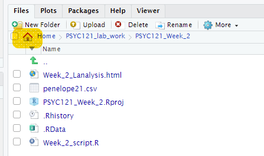
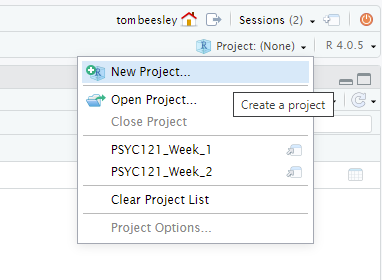
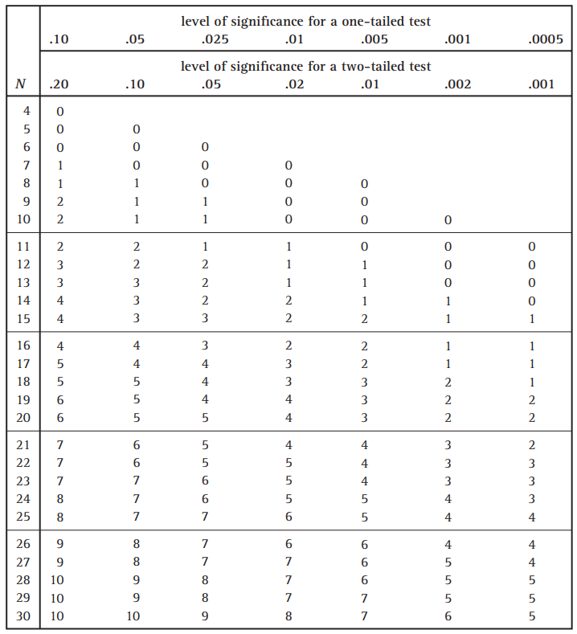

---
output:
  html_document: default
  pdf_document: default
---


```{r eval=FALSE, include=FALSE}
library(tidyverse)
load("tidy_data.RData")

# set up the data for Task 2
data %>% 
  rowwise() %>% 
  mutate(screen_time_actual = mean(c(screen_time_actual_android_h,
                                     screen_time_actual_iphone_h),
                                   na.rm = TRUE)) %>% 
  filter(screen_time_actual > 0) %>% 
  select(phone_type, screen_time_actual, screen_time_estimate = screen_time_estimate_h) %>% 
  write_csv("data_phone.csv")

# set up the data for Task 3
data %>% 
  select(home_location, uk_salary) %>% 
  write_csv("data_salary.csv")


```

# Week 6: [NOT FOR CLASS TEST!] Visualising data and binomial tests

> Written by Tom Beesley & John Towse

They say a picture paints a thousand words, so in this week's lab we will be learning some fundamental skills in **data visualisation** with the `ggplot()` commands.  We will then conduct our first statisitical test to tell whether there is a *real difference* in our data. You must ensure you have watched the lecture and done the pre-lab work before coming to class. 

## Pre-lab work: online tutorial

To access the pre-lab tutorial click here: <https://ma-rconnect.lancs.ac.uk/Week6_LabPrep/> (on campus, or VPN required)

## RStudio Task 1: Creating a new folder and project

We are going to set up a new foler for this week and an RStudio *Project*. This is a good practice for organising your scripts and data. 

1. When you are logged on to the [RStudio Server](http://psy-rstudio.lancaster.ac.uk), navigate to your home directory by clicking on the small house icon:



2. Click the "New Folder" button just above the home button. Name the folder something sensible (e.g., Week_6) and click OK.

3. Click on this folder and then click "More" and "Set As Working Directory". This tells RStudio that you are now working in this directory. When you read in data using `read.csv` it will know where to look for the file name that you provide.


4. Let's add the files we need for this week. Download the [Week_6_files.zip](files/Week_6/Week_6_files.zip) and upload it into RStudio Server. If you need them, [here are the key instructions](#uploading_zip) from Week 2.

5. Now let's finish this process by making this a *Project*. Click on the small blue icon in the top right of RStudio, and clicking "New Project":



6. You may be asked to save the workspace or data - you should do this. Then select "Existing Directory" and make sure that the new directory you have created is selected as the "Project Working Directory" - it should be, if you set the working directory correctly above. If not, navigate to the correct directory here.

7. And you're done! This should now appear as a project in your front page on RStudio. You can get back to that front page by clicking the red power button in the top right corner. Using projects has many benefits. It will keep all the content for the week in one place, and save the commands you've used in the console. You can also use the *Project Menu* to navigate quickly between different projects.


## RStudio Task 2: Visualising phone use

Now that you have completed the online tutorials on `ggplot()`, it's time to put those skills into practice with a new data set, provided in "data_phone.csv". In the survey, people estimated their daily phone use, and then looked up the actual time their phones were on. 

1. Open the script "Week_6_script.R". This is the script file you will use for tasks 1 and 2

2. Run the first two lines of code `library(tidyverse)` and `data <- read_csv("data_phone.csv")`

3. You should now have an object in environment called `data`. You can view this (the "spreadsheet view") by clicking on the object.

4. Try running the ggplot command. You will see that this generates an error in red. Oh no!! Don't panic. Look at what it's telling you is wrong. Let's look at the ggplot command and edit it to make it display something. As a reminder from the online tutorial:

> The main graphing command is `ggplot()` which tells R we want to draw some kind of plot. If you want to, you can just run `data %>% ggplot()`, and you'll see that R produces just a blank plot window. The plot is blank because we haven't told it a) what type of plot we want, and b) what data to plot.

>Note that the next line is **added** to `ggplot()` (i.e., `ggplot() + geom_point()`). Plotting with `ggplot()` involves adding elements (geoms) together. Think of it as adding layers on top of each other: the ggplot() is your pizza base, and the geoms and other features are the toppings! 

> Within the `geom_point()` command we have the very important command of `aes()`. This stands for **aesthetics**. `aes()` tells ggplot how the data should be represented on the features of the plot.

5. Add y and x components inside the `aes()` command. These are used to map variables in your data to the features of the graph. If you are stuck on this, it's time to go back and look at the 

4. Inside the `aes()` command, map the variable *screen_time_estimate* to the x axis, and the variable *screen_time_actual* to the y axis. In general, does it look like people's estimates were accurate?

5. Add a setting for *colour* outside of the `aes()`, to make all the points red. Why outside of `aes()`? Well remember from the online tutorial:

> Careful observation of the code here will show you that these new commands are written **outside** of the `aes()` command. This is really important to note. We write these outside of `aes()` because these features of the plot **are not related to the data**. We are NOT *mapping* any of our data to these features. Instead, we are simply specifying one particular value for each of these "settings" in the plot

6. Now map the *colour* to the variable *phone_type* (within `aes()`). Can you see any differences between people who have different phones?

7. Try changing your `geom_point()` command to `geom_jitter()` (keeping the mappings the same). Suddenly this reveals many more points! Why is this? Check the help to find out more about this geom: `?geom_jitter`.

## Task 3: conducting a sign test

Let's now look at whether these differences we see are meaningful. Do people estimate their daily screen time to be more than it actually is? There are two blocks of code to run here. You don't have to edit these, but it's important to look at what they are doing:

1. Run the first block of code. This adds a new column to the data, *est_diff*, which means the "estimate difference": actual screen time minus estimated screen time. You can take a look at this code by clicking on the new object in the environment, *data_phone_diff*. What do the positive and negative values reflect?

2. Run the second block of code. This filters out (!= means "not equal to") the zero values in the est_diff column. Why is this important for the sign test?

3. The result of the final line of code (`count()`) will be output in the console. This tells us how many values were above 0 (TRUE) and how many below zero (FALSE). This is all the information we need to conduct the sign test:

  + How many observations were there in total? 
  + Use the sign test table below to determine how many values *against the majority* we would expect, according to the null hypothesis. 
  + Is the value in our data more or less than this? 
  + Does this mean there is a significant over or underestimate in people's estimates of phone time usage?



## Extra content!

Visualising data is all about communication: how can I communicate my results so that it makes the data very easy to interpret. Try these additional steps:

1. Add a `labs()` layer to modify text on the graph. If you're not sure how to do this, then feel free to go back to the online tutorial, or take a look at the help wiht `?labs`. Try changing the axis titles and add a title for the graph.

2. Change the theme of the graph. Try `?theme_classic` for help.

3. Graphs can be saved by clicking *Export*, then *Save as image*. Set the dimensions to how you like it to look, give it a suitable filename, and click save.


