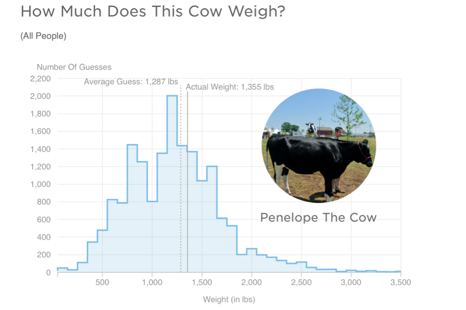
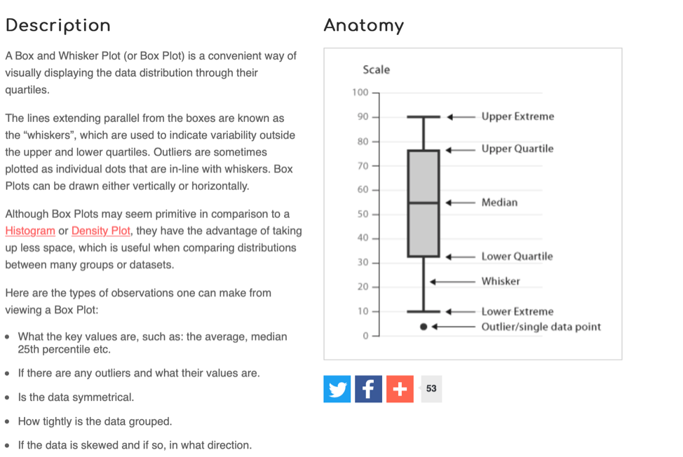

# Week 2: Descriptive statistics in RStudio


## Pre-lab work

Last week, among other things, we asked you to

-   Roll some dice, carry out some (relatively) straightforward 'hand' calculations of central tendency
-   Connect to the RStudio server and create a folder
-   Within RStudio upload and run a script - a set of instructions, and explore annotations
-   Adapt the script commands to perform calculations on the dice rolls within RStudio
-   Complete a survey so that we can collect data for analysis teaching

Your progress was great! We start with small steps and build up - but this is a nice start and we're pleased how things went!

Before the lab, make sure you have worked through the material in the week2 learnr tutorial. 
[The link is here](https://ma-rconnect.lancs.ac.uk/W2LabPrep/){target="_blank"}


### R Studio tasks

For a reminder of how to start RStudio, 
[see week 1 lab sheet](https://tombeesley.github.io/PSYC121_2022-23/#task-3---using-rstudio){target="_blank"}


(remember: off campus, you will need to be on the VPN)

>A word of advice (from David Howell's statistics book: "One more word of advice
"I can't resist adding what is perhaps the best advice I have. If there is something that you don't understand, just remember that "Google is your friend." She certainly is mine. (Well, maybe Google is getting a bit pushy, but there are many other search sites.) If you don't understand what Fisher's Exact Test is, or you don't like my explanation, go to Google and type in Fisher's Exact Test. I just did that and had 260,000 hits. You can't tell me that there isn't going to be something useful in there.)"

### Bringing data, scripts and files into R Studio

In week 1, we had a tiny dataset (relatively speaking) that we entered into R through a script line. 
That worked for what is was. But it's going to become painful and tedious when (a) we want to work with larger datasets (b) we have data more complex than a 1-dimensional list of numbers (think about some 2-dimensional data sheets you might have encountered in excel for example)

R can handle data files, and this week we're going to explore them. Within R, we can specify 'data frames' which can have, essentially, multiple columns of data, and we can link data files to data frames for processing

To make things straightforward, each week we'll provide students with a "zip" file that contains the script to start from (which you can expand and annotate etc, and save on your file space). We'll also provide a data file or data files for you to use in the zip file. R can then *import* these files into the RStudio environment. So when you upload the zip file, you can import the data AND you can open up the script

## Lab exercises - descriptive information in R Studio

Some years ago, a large group of participants gave an estimate of the weight of Penelope the cow. Just over 17,000 guesses. And the distribution of guesses was something like this:


What we can see from this graph is that:

1.  Guesses formed a roughly normal distribution. There is a bit of a skew with a right-hand tail, but this is inevitable as a weight of less than 0 is physically impossible, but there is no limit of the semantics of a large guess.
2.  The mean guess weight (1,287 lbs) is very close to the actual (true) weight of the cow (1,355 lbs). So even though lots of people were inaccurate, a central tendency measure has a pretty good alignment with the true weight. This is known as the Wisdom of Crowds phenomenon, first identified by Galton in 1907 (though he suggested using the median weight)

Let's look at (a sample of) the PSYC121 student data collected on guessing the weight of Penelope, and ask whether it resembles the properties of this large dataset.

### Loading the data

Using the instructions and advice given on Moodle, get the `week2.zip` file and bring the data and R script into R Studio. [The week 2 zip file is here](files/Week_2/week_2.zip)

### Using the R script

Step 1. Download the `week_2.zip` file
(If you are using a mac, there is a video guide on Moodle to explain how to download the zip file as is)

Step 2. Open the appropriate folder on the RStudio server

Step 3. Upload the zip file

Let's start working with our data, by opening up (clicking on) the script "Week_2.R" file.


The first command is to load a library of functions:


```r
library(tidyverse)
```

To run this, simply click anywhere on line 1 of the R script to put the cursor there, and press ctrl+enter (cmd+enter on a mac) or click the button called run. You will see a number of messages appear in the console. Don't worry about these, or worry too much about what exactly this command is doing. Essentially this is giving us some useful tools for our analysis. We will introduce the features of the **tidyverse** gradually during this course.

(side note: If you were using a local version of R studio on your computer, it might not have the 'tidyverse' library already installed. You would need to install the package first)

The data are on the RStudio server if you have followed all the lab sheet to this point. Note that when you imported the data into the R environment, a command line was generated at the console


```r
cows <- read_csv("~/penelope22.csv")
```

What this command accomplished was to read the spreadsheet called 'penelope22' into an object in R called `cows`. You could use any object label, but it's important to then keep that name consistent in what you do next.

The command was also generated


```r
 View(cows)
```

which presents the data in a window of RStudio. Note that "NA" means not available or missing data. Does this file structure make some sense to you?

### Finding the mean and median estimates

Use the data to answer the following questions...

1.  What is the mean weight estimates?
2.  What is the standard deviation of the estimates?
3.  What is the median weight of the estimates?
4.  Which of these central tendency measures is the more accurate measure of the true cow weight? (make a judgement)
5.  What is the mean weight estimate (and standard deviation) for female respondents and non-female (male / non-binary /prefer not to say) respondents?

You may be thinking, how do I possibly do any of this?! Well this week most of the commands you need are contained in the R script you have downloaded. Also, remember from last week, we explored the R command:


```r
mean(week_1_lecture_dataa)
```

That gave us the mean of the small dataset `week_1_lecture_data`. This time, we want to explore the penelope dataset. But also, the lecture_data was just a single list of numbers. The penelope22 object is more like a datasheet. So we need to tell R Studio which **column** we are interested in. RStudio uses the format **data$column**. So run the followinbg line in the script


```r
mean(cows$estimate) 
```


```r
sd(cows$estimate)
```


So from this, can you work out what you would do to get the median value (remember from last week how we got the median value?)? Part fo the command is given to you, can you change the text so that it works?

### Calculations from a range of columns

We have seen that:


```r
mean(cows$estimate) 
```

will provide a mean of the column "estimate". In the third column, named "female_estimate", we have the estimates of just the female respondents. In the fourth column, named "other_estimate", we have the estimates of the "other" respondents (males and non-binary and prefer not to say).

So can you now figure out how you might get information about the estimate from the female data (only) or the non-female data? Try it, based on what you have just done. Does it work?

You will find that the result of the this command produces an "NA" result. This means that the answer is "Not Available", or in other words, is a "missing value". This is because some of the values in this column are NA, and the mean of a column with NAs will always lead to the result NA.

Instead, try change the script so it looks like this:


```r
mean(cows$female_estimate, na.rm = TRUE )
```

Any different? The `na.rm = TRUE` instruction tells RStudio that missing data can be ignored in this mean calculation. (in technical language, `na.rm` is a parameter of the function `mean` that removes the NAs if set to TRUE)

### Simple graphs

RStudio can be used to create graphical data plots that can help interpret datasets

The first thing we can do is create a histogram distribution of guesses from the sample student data to compare with the previous large sample study (i.e. the 17,000 guesses):


```r
hist(cows$estimate)
```

One way to alter or adjust the histogram is to change the width of the bars, the intervals, between each plot section. Try run this line from the script


```r
hist(cows$estimate, breaks = ??)
```

Does it work? No? What you need to do is replace the two question marks in the script (or better still, create a new instruction line in which you amend this to have a numerical value representing the number of different plot bars. Try at least 3 different values. Look at and think about how this affects the visual distribution.


We can also create a "box and whisker plot". Here's a general simple description of a box-and-whisker plot as a graphical representation of data:



### Additional challenge

In the zip file, we also provide data on the estimates of the percentage of immigrants in the UK. This will allow you to explore the data discussed in the analysis lecture, and create visualisations of the data and its spread. Can you apply the analysis of the penelope data to the immigration data?
