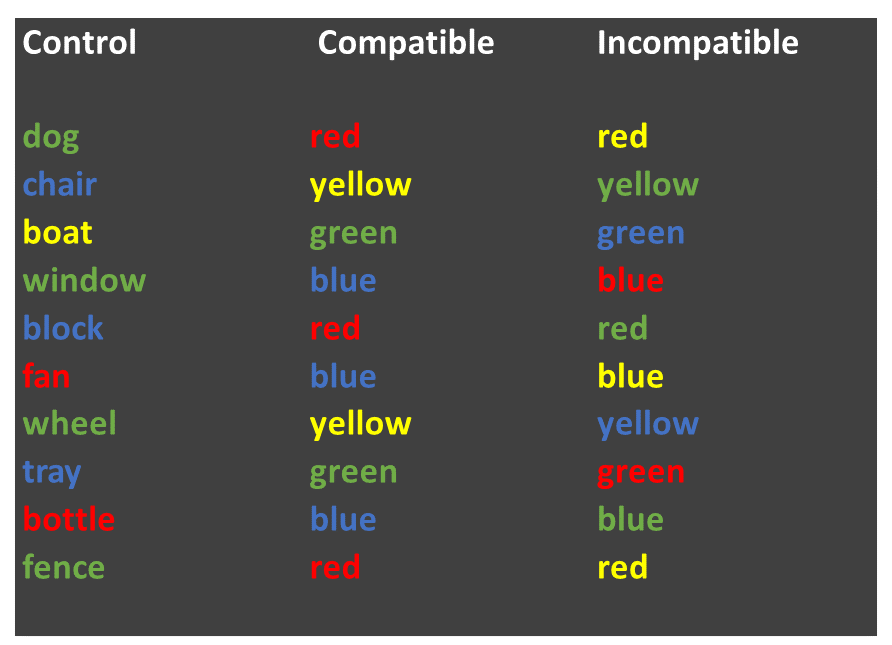

---
output:
  html_document: default
  pdf_document: default
---

# Week 8: Related-samples t-tests, plotting means and SE bars

> Written by Tom Beesley & John Towse

Today we will take a look at summarising means and standard errors (SEs) from our data. We will look at how we plot these together on the one graph (using `ggplot()` commands that allow us to share mappings between different geoms0. We will explore our data on the famous “Stroop Task” and we will use a related-samples t-test to examine the differences between the means of our different conditions in this task. 

## Pre-lab work: online tutorial

**Online tutorial**: You must make every attempt to complete this before the lab! To access the [**pre-lab tutorial click here**](https://ma-rconnect.lancs.ac.uk/Week_8_LabPrep){target="_blank"} (on campus, or VPN required)

**Getting ready for the lab class** 

1. Create a folder and a Project for Week 8. [Click here for the instructions](#creating_project) from Week 6 if you are unsure.

2. Download the [Week_8.zip](files/Week_8/Week_8_new.zip) file and upload it into this new folder in RStudio Server. If you need them, [here are the instructions](#uploading_zip) from Week 2.

## Calculating means and SEs 

The “Stroop Effect” is a classic demonstration of automaticity of behaviour. Participants have to say the colour a word is printed in, which is an easy task for a “compatible” stimulus like **GREEN**, and a much more difficult task for an “incompatible” stimulus like **BLUE**. We can’t help but read the text - it has seemingly become an automatic process.

In this task we will calculate the means and standard errors of the means. We will then plot them using
ggplot().

1. Open the script “Week_8_script.R” (see prep work)

2. Run the `library` and `read_csv` lines of code. You should see an object in the environment called *data_w8*

3. View the data with view(data). You will see that the data are a little different from the data we have worked with previously. We have an *pID* variable, which gives a unique number for each person. Each person has 3 rows. This is because the different conditions of the Stroop task reflect a **within-subjects variable** (related samples). For data like this it is often useful to have them arranged in what is referred to as “long format”, with multiple rows for each response the participant provides. For the current data that means we have a variable called *condition*, which is our IV, and one called *time* which is our DV.

4. Let's look at the distribution of *time* (our DV) as a function of *condition*. Complete the next chunk of code by mapping *x* to *time* and *fill* to *condition* for our `geom_density()` plot. As per last week, you will want to set the *alpha* parameter to something between 0 and 1 - note that this is done OUTSIDE of the `aes()` command.

5. We seem to have some outlier values at both the high and the low ends. It's probably best if we remove data for the whole participant if their *average* time is unusual. To do that, we'll need to create a new column (remember `mutate()`?) to give us these average time values for each participant. Run the next block of code (you don't need to edit this one) to create the new column, then run the next line to `view()` it.

6. Edit the `geom_histogram()` command to plot the values of the *avg_time* column. 

7. We now need the filter out the values in our data that we feel are unusual. Like last week, we will do this in a fairly unprincipled manner, by "eyeballing" the data (next week we'll consider something a bit more "scientific"). Complete the filter command so that it removes both the very low values in the *avg_time* column, and also those that are very high. Because you want to filter out low AND high values, you are using an **AND** expression (**&**). You will therefore need to enter in two numerical values, based on your assessment of the histogram produced for Q6. Note that the filtered data is stored as a new object: *data_w8_f* ("f", for "filtered").

## Running related samples t-tests

We have seen in our density plots that the reaction times (DV) look different in the three different Stroop conditions (our IV). But now we need to look at whether there are **statistically significant differences** between the means of the three conditions. 

To do this, we will first summarise the mean time taken by each condition in the Stroop task. [Remember from Week 3](#group_by) that we can use `group_by()` and `summarise()` to get summary stats (e.g., mean, sd) at each level of the IV. That's what we want to do now:

1. Edit the `group_by()` code to specify the IV and the `summarise()` to calculate the `mean()` of our DV. If you do this correctly, you'll get three values - a mean value for each level (condition) of our IV. Do these means reflect what you would expect in the Stroop task?

2. Next we need to test if these differences between our means are real. To do that, we can run a related samples t-test; remember that the data for each level of the IV in this experiment came from the same person. We must use a `filter()` to restrict the data to just two levels of the IV: the *condition* column/variable in the data. This is because a related samples t-test looks at the difference between two means (and only two), so the column we use for the t-test needs to have just two levels of the IV (two of the conditions).

3. The filter command is already set up to restrict the data to two of the conditions. Note that the filter uses an “|” symbol, which means “or”, because we want the data that **is the same as** (==) one condition OR the other condition.

4. Run the t-test on this selection of data, to compare the means from these two levels of the IV. Is the
result significant? Note the t-value and the p-value. How would you express this as a statement in a report?

5. With 3 levels to the IV *condition* there are 3 possible comparisons we can make (1 vs. 2; 1 vs. 3; 2 vs. 3). Complete all three tests, by copying and pasting the commands, editing each to make a different filter selection, and then to run the t-test. Make sure you interpret the results of the t-tests. 

## Plotting the means and SEs

1. In Task 2 you calculated the means for each condition in the Stroop task. We've seen in lectures that "standard error" provides an estimate of how variable that mean will be across the samples we collect. In the online tutorial you were shown the code for creating the SE. Complete the code to add in the relevant variables to calculate both means and SEs. The code from Task 2-Q1 will give the mean; you simply need to add the correct variable (DV) to the `sd()` command to calculate the SE values (note that you don't need to put anything in `n()`, as this simply calculates how many rows there are).

2. View the new object *data_w8_summary*. Check that the means and SEs are different for the 3 conditions. If they are the same, you probably summarised the wrong column!

3. Now complete the ggplot command to first plot our DV, the *stroop_mean* (y), as a function of the IV, *condition* (x).

4. Now we need to add some "error bars" which provide a visual guide as to how much variance there is in our data (or how much uncertainty we have in our mean value). This figure illustrates how we would typically present error bars with mean values. 

5. Edit the code for the `ggplot()` command that plots both `geom_col()` and `geom_errorbar`. You will need to calculate a `ymin` and a `ymax` value. Use the illustration above to work out how to combine the mean value and the SE value to create the right `ymin` and `ymax`. 

EXTRA: These next steps can be completed to practice customising your plot

6. Add a `labs()` layer to the plot to change the axis titles, and the title of the plot.

7. Change the theme of the plot (e.g., `theme_void()`)

8. Map the *fill* aesthetic to the variable *stroop_condition*. You can do this for `geom_col` or `geom_errorbar` or both at once by putting it in the `aes()` within the `ggplot()` command.

9. Manually change the colours of the columns with using `scale_fill_manual()`. Take a look at the [Week 7](#density_plots) instructions on how to do this.

## Saving your work

**Scripts:** By now you are hopefully getting used to editing and working within the script (if not, see the video on working in the script vs. console on Moodle). To save a script, you simply click the save icon, or press ctrl+S (cmd+s on a mac).

**Plots:** To save a graph you have produced, click the "Export" button in the plot window, then "Save as Image". You can resize the graph and give it an appropriate filename. If you've set the working directory correctly, then the new file should appear in the current folder. 

**Data:** The data objects you create (in the Environment) will be saved automatically if you have created a project. However, this data only exists within RStudio. What if you want to use the data elsewhere? For example you may want to share the data with a project supervisor. To do this, we need to write the data to a csv file (like those we use to import the data). You can do this with the following command: `write_csv(the_data_object, "the_filename.csv")` 

**Exporting from RStudio:** The above save operations save files to a folder within RStudio Server. At some stage you will need to get these files out of RStudio Server, for example if you need a graph for your report, or you need to share the data or the scripts. To do this, simply select the files you want in the Files pane, click "More" and then "Export". Selecting multiple files will produce a ".zip" file, which will need to be "unzipped" on your computer to access the individual files ([instructions for Windows](https://support.microsoft.com/en-us/windows/zip-and-unzip-files-f6dde0a7-0fec-8294-e1d3-703ed85e7ebc){target="_blank"} and [instructions for Mac](https://support.apple.com/en-gb/guide/mac-help/mchlp2528/mac){target="_blank"})

## Answers

When you have completed all of the lab content, you may want to check your answers with our completed version of the script for this week. **Remember**, looking at this script (studying/revising it) does not replace the process of working through the lab activities, trying them out for yourself, getting stuck, asking questions, finding solutions, adding your own comments, etc. **Actively engaging** with the material is the way to learn these analysis skills, not by looking at someone else's completed code...

Download the [answers script](files/Week_6/Week_6_script_answers.R) 
