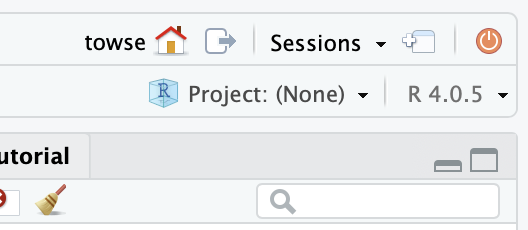

# Week 1 - Introduction to PSYC121

> Written by John Towse & Tom Beesley


## Analysis labs and 'pre-lab' activity

For each lab session that you have been scheduled to attend, please come "prepared'. By this we mean

-   You have watched the lecture video, made notes, and developed questions where you have them.

-   You have worked through the online "prelab" preparation materials - [Here is the one for Week 1](https://ma-rconnect.lancs.ac.uk/Week_1_prep){target="_blank"}

-   You read the lab sheet (this one) to get a sense of what we're going to be doing, and you anticipate potential problems so that you can focus on these in the session.

The lecture is designed to deliver important ideas and procedures for learning about analysis. Pre-lab material is then designed to help consolidate this learning, or enhance, expand and apply it in ways that set the scene for the lab session activity.We want to prepare you to be ready to go in the session itself and make the most of your time there.

Want additional support? Keep in mind that the Department has endorsed and will use the Statistics textbook by David Howell called "**Fundamental statistics for the behavioral sciences"**

The book covers principles of statistics as well as some tutorials on using R. You can access a library copy [from the library pages](https://onesearch.lancaster-university.uk/permalink/f/cssk39/44LAN_ALMA_DS51180136050001221){target="_blank"}

## Activities for this week

## Task 1 - check-in with the University attendance register

When you arrive, make sure you have checked-in to your Analysis session in the Levy lab. All students are required by the University to [confirm attendance at taught session](https://www.lancaster.ac.uk/student-and-education-services/check-in/){target="_blank"}

Staff will remind you of this in your class.

## Task 2 - Getting dicy

{width="3in"}

Here's a simple task for you to complete as a group around each of the workstations;

You will be given a pair of dice

1.  Working in pairs, one person rolls both dice.

2.  Add up the total on each of them and have someone record that total (if you don't have some spare paper or a pen, use your computer)

3.  Repeat those steps 20 times.

4.  Then swap over your roles (the person rolling the dice, the person recording the outcome)

5.  Once everyone at the workstation has had a turn at this, each person should attempt to work out (a) the mean and (b) the median of their dice roll total.

6.  Check each others working, and discuss any differences or problems you have.

Are all your answers the same? Why / why not? If not, are they very different or very similar?

## Task 3 - Using RStudio

### Introducing R Studio

R and RStudio is the software that we will be using to explore and learn about analysis in your Psychology degree. It's a computational engine: a very snazzy calculator that you should see as your friend and ally in the journey to understand and appreciate psychology. It sits *alongside* what we teach about the concepts and interpretation of statistical analysis.

R is the core software, RStudio is the interface for interacting with it. Put another way, *R is the engine, RStudio is the cockpit.*

Like even a simplest calculator, it just does what you ask (at least when you ask nicely!) but it requires the user to know what they want from it and to understand what it is telling you. A calculator can't help a kid get the right answer to a multiplication problem if they don't know the difference between multiplication and division and addition etc. And whilst a calculator is brilliant at doing the number crunching (and as a bonus, R Studio can help with turning the numbers into beautiful graphs and images too), even a calculator requires a thoughtful person to take the answers and make sensible interpretations from them.

Therefore, we need to learn both about the concepts of statistical analysis on the one hand, and the processing of statistical information -through R- on the other. The lectures will provide the starting point and the direction for statistical concepts, whilst these analysis labs provide the more practical experiences in how to use R, and how to make R your ally. Over the next year, in these labs we will increasingly be using RStudio to focus on the latter, processing side, which will allow you to focus your energies on the conceptual side and its relevance for appreciating psychology.

### Getting started with RStudio {#getting_started}

For Lancaster University Psychology Students in 2022, we will be learning about R Studio through a simple but powerful web server architecture. That is, through the power of the internet, you can access and use R Studio by logging into a free account that we have provided and we will maintain for your use.

> Here's a little secret: There are several different ways to access RStudio. For example, you can download a copy of the software onto your computer, or use a Virtual Machine set up to run a copy. There's nothing to stop you having your local copy, but please note - we can't support your own version through lab classes. We're using the web server to make sure everyone has the same, controlled experience.

You will have received an email with your account information to log onto From a computer on the campus wifi, you can access R Studio at:

[Lancaster Psychology R Studio Server](http://psy-rstudio.lancaster.ac.uk){target="_blank}

At the login screen, use your university username (e.g., bloggsj)

Your password for R Studio is: [password here]

As it says in the subject line, please keep your account details safe!

### What does RStudio look like?

When RStudio starts, it will look something like this: 

RStudio has three panels or windows: there are tabs for Console (taking up the left hand side), Environment (and History top right) , Current file (bottom right). You will also see a 4th window for a script or set of commands you develop, also (on the left hand side).

### Let's get started!

The first thing we want to do in RStudio is to create a folder for this week so that we can put the relevant material there and keep it tidy.

From the lower-right panel of RStudio, click the files tab.

Select the "new folder" option and create a new folder (eg "week 1")

Click on that folder to open it

Next, we've prepared some *instructions* for RStudio to use - this is called a "script". So we need to get this script into the server for you to explore and play with

1.  Download the "zip" file by [clicking this link](files/Week_1/week_1.zip)

2.  Find the location of the file on your computer and check it is saved as a ".zip" file

3.  Return to RStudio

4.  Click "Upload"

5.  Click choose file and find the file on your computer.

6.  Select the file and click "Open". Click "OK"

You should now see the files extracted in the directory. If you receive an "unexpected server error" please try this process in a different browser. If you still have trouble, send your username to [t.beesley\@lancaster.ac.uk](mailto:t.beesley@lancaster.ac.uk) for support.

You should now have the script available in RStudio.

Use "Save...As" to create a new version of the script. By doing this, you'll be able to have a "before" and "after" version of the script and can go back over the changes

In the script, select or highlight the first line of text, which is this one:

#### Run your first ever R instruction!


```r
5 + 5
```

and "run" this line. That tells RStudio to carry out the instruction.

You should see that in the console tab, RStudio calculates the answer to this incredibly hard maths challenge! (amazing huh? OK, maybe not \*that\* amazing...).

#### Modify your first ever R instruction!

Use your imagination -- add a new line to the script and ask a different simple arithmetic question of your own choosing! What happens?

#### Calculate descriptive stats in R for the first time!

In this week's analysis lecture, we looked at measures of central tendency and how to calculate them. So let's get R to do these calculations also!

First, we tell R about the data used in the lecture. We've already created the instruction that will do exacly this and it is in the script, so run this line from the script


```r
week_1_lecture_data <- c(7,8,8,7,3,1,6,9,3,8)
```

This creates an "object" called `week_1_lecture_data`. We can then perform calculations on this object. For example, we can find the mean by running the following command (use the script to do this)


```r
mean(week_1_lecture_data)
```

Check the answer is the same we found in the lecture (it should be 6!).

Next, let's ask for the median by running this line from the script:


```r
median(week_1_lecture_data)
```

This also should be the answer from the lecture (7)

R doesn't have a single corresponding command for the *mode*, but we can use the block of code in the script for this that starts and ends with the "getmode" text (there are 6 lines of text)

This is just a bit of clever jiggery-pokery that gets the mode. What does R say the mode is?

#### Your challenge

How can you get RStudio to verify / check the dice calculations that you attempted earlier? Think about how you might solve this problem, on the basis of what we have covered so far.

We will discuss this in class and attempt to get RStudio to check your answers. In doing so, annotate the script (add notes for you - not RStudio) using the "#" command

## Before you finish

a)  Make sure you save a copy of the script that you have been working on by the end of the session. This provides you with the record - the digital trace - on what you have done. And it means you can come back and repeat any of the work you have performed.

b)  End your session on the RStudio server, this logs you out of the server and stops any ongoing activities and tasks you have set up, maybe in the background.

    {width="2.5in"}

    There is a red "power" button near the top right of the R studio window (do ask for help if you can't find it). It's a good habit to get into to turn the session off

### Extra content for outside the lab class

a)  In the Howell text book on statistics, there's some R code on descriptive statistics. It is included in the script for you to look at and play with.

b)  in your own time and think about the following:

In R, "\<-" is the assignment operator as in the command we used:


```r
PSYC121_week_1_data <- c(7,8,8,7,3,1,6,9,3,8)
```

We create the variable label on the left (Analysis_week1_data`) and we give it those numbers on the right. The name`Analysis_week1_data` is largely arbitrary: try use a variable of your own naming (your own name?) instead - and then use that alternative name for the other commands.

------------------------------------------------------------------------

Throughout this year, we'll use the convention of the "underscore" to separate words in labels (it_makes_them_easier_to_read than ifyoudidn'thaveanyspaces)

------------------------------------------------------------------------

## Task 4 -- Review the learnr sample / practice questions

After every block of teaching in part-1 analysis (specifically, we mean in week 5, week 10, week 15 and week 20) there will be a class test. This will assess your knowledge and your understanding of the material that has been covered.

The class test will comprise a set of Multiple Choice Questions (and the set of questions will be different for each student, as the test will involve random selection from a larger pool) under timed conditions.

In order to help you get (a) a broad or basic feel for the sort of questions you might get in the class test (b) self-review your progress through the term, we will provide MCQs each week for you to attempt.

So these are for your benefit... you can take the questions when you choose to, and the learnr quiz will provide feedback on the answers your provide. Just bear in mind:

a)  We place a set of questions at the end of the learnr pages so that you can attempt these at the end of each week, after you've completed lab activities, follow-up work, weekly Q&As etc. But it's up to you when you answer the questions

b)  These are meant as *indicative questions*. There's no point in learning/ memorising these questions (they won't be on the quiz!) and our advice is to reflect on how the teaching and content links to the sorts of questions that get posed.

## Task 5 -- Data collection exercise

In order to learn about psychology and data analysis techniques, we need data! Rather than rely too much on artificial data (certainly it is sometimes useful to say "Here are a bunch of numbers and this is what we can do with them" -- think about the R Studio example for this week's lab) for the most part, we prefer to draw on datasets that are a bit more engaging and meaningful that you have a stake in yourself! By using a common data set, that we can return to over the year, we can also build up familiarity and confidence in the data and remove a potential obstacle to thinking about the more important analysis part.

So a key task will be for everyone to have a go at taking our online survey, and contribute to a dataset that can be used throughout the year.

We would like you to complete the survey via your Department Sona system account. This way, you will receive a research credit for doing so, to "jump start" your credit account.

The sona system is can be accessed [by following this link](https://lancs.sona-systems.com){target="_blank"}
