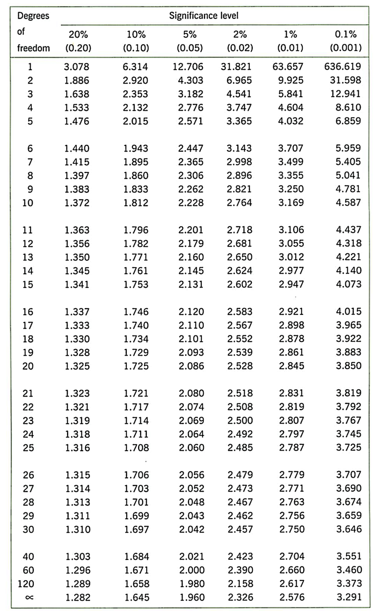

---
output:
  html_document: default
  pdf_document: default
---


```{r eval=FALSE, include=FALSE}
library(tidyverse)
load("tidy_data.RData")

# set up the data for Task 3
data %>% 
  select(home_location, uk_salary) %>% 
  write_csv("data_salary.csv")


```

# Week 7: One-sample t-test on salary estimates

> Written by Tom Beesley & John Towse

Today we will look in a bit more detail at people's estimates of the average UK salary. We will first plot this data using `geom_histogram()` and also `geom_boxplot()`. When we do this, we'll see that there are some unusual values, and we'll need to do a bit of **data wrangling** to remove them, using the `filter()` command. We'll then turn to the conceptual ideas of the lecture - how can we tell if the mean of our sample is unusual, or whether we would actually expect this mean value under the null hypothesis? Finally, we'll continue to develop our skills in **data visualisation** by exploring `geom_density()` plots.

## Pre-lab work: online tutorial

**Online tutorial**: You must make every attempt to complete this before the lab! To access the [**pre-lab tutorial click here**](https://ma-rconnect.lancs.ac.uk/Week_7_LabPrep){target="_blank"} (on campus, or VPN required)

**Getting ready for the lab class** 

1. Create a folder and a Project for Week 7. [Click here for the instructions](#creating_project) from last week if you are unsure.

2. Download the [Week_7.zip](files/Week_7/Week_7.zip) and upload it into this new folder in RStudio Server. If you need them, [here are the instructions](#uploading_zip) from Week 2.

## Plotting and filtering

**Important!** - You should be using the Week_7_script as you work through these tasks. Edit the script to complete the tasks. Running code from the script is easy - place your cursor on the line or block of code you want to run and press "run" (of ctrl/cmd+enter). See the video on Moodle if you're unsure. Save your script as you go to keep a record of your work.

1. Open the Week_7_script and run the `library`, `options` and `read_csv` commands. The `options` command is new. It is very cryptic and you don't need to worry too much about this - it is making sure that the values in the graphs are displayed as regular numbers and not as scientific notation.

2. Complete the `geom_histogram()` code to plot the distribution of salary data

3. OK - we've got some pretty funky values here! Some people think the average salary is over £300,000!!! Well, maybe they just added too many zeros (let's give them the benefit of the doubt). Quite often when we get our "raw" data, it contains weird values like this that we need to consider removing. Let's run the `arrange()` code now to see what exactly those high values are.

4. We'll need to remove these high values to get a better sense of the distribution. Let's use a `filter()` command to do this. We need to make a decision about what values to exclude. In later labs we'll look at a more systematic process of removing *outliers*, but for now, let's just remove any that are over £200,000. Edit the `filter()` command to keep only those estimates that are *below* £200,000 (<). Remeber that the filter command *keeps* the data that is *TRUE* according to the expression. Also note that you are making a new object at this step: *data_w7_f* .

5. Now your filter has done its job (check the Environment to make sure *data_w7_f* has fewer rows than *data_w7*), let's plot the data again. Edit the `aes()` command of this next code chunk to draw a new histogram.

6. And as you know, we can also look at the distribution as a boxplot. Edit the `geom_boxplot()` code to do this.

## One-sample t-test

We now want to know if the salary estimates are different to the actual average salary in the UK (which is approx. £30,000). Our hypothesis might be that people are inaccurate - they overestimate or underestimate the average UK salary. Let's test that.

7. The first step towards this is to calculate a mean of the column of salary estimates. Edit the line of code with `mean()` to tell R to compute this value. Remember to use the new data object you created after you removed the outliers. If you're struggling to remember how to compute a `mean()`, jump back to the [Week 2 content](#mean_median)

8. Now we can compute a t-statistic and check its significance with `t.test()`. Edit the code on this line to conduct a one-sample t-test. You need to provide **the sample of data on which you want to conduct the test**, and the **expected mean under the null hypothesis**. Remember our hypothesis is that people are not accurate. Your calculation of the mean should tell you whether they numerically overestimated or underestimated. But would we expect such a result under the null hypothesis? Run the t-test and **note the p value**. How likely is it that we would see this sample of data (this mean value and the distribution of data - the SD) under null hypothesis? The p value ranges from 0 to 1. If it is very low - typically we say p < .05 - then we conclude our result is unlikely under the null hypothesis and it is therefore a *significant result*.

10. What is the critical value of t in the t-distribution table, for this sample size? Degrees of freedom is N - 1.




## Density plots: salary estimates by home location {#density_plots}

11. Draw a `geom_density()` (density plot) by adding an *x* mapping for the *uk_salary* column inside `aes()`. This plot can be thought of as a smoothed version of the histogram.

12. Now map the *fill* feature to the variable *home_location*. This should create 3 density plots, one for each home location. You might find that it's a bit difficult to see the shape of all three distributions. To make things clearer, add `alpha = .5` **outside** of the `aes()` command in `geom_denisty()`. This should make the plots a bit more transparent. Try playing around with different values of alpha between 0 and 1. 

13. Manually change the colours of the columns by adding (+) this code as a layer to your ggplot code: `scale_fill_manual(values = c("darkgreen", "darkblue", "darkred"))`. Take a look [at this PDF](files/Week_7/Rcolor.pdf){target="_blank"} for more colour options than you'll probably ever want!

14. You can save your graph outside of R by clicking Export -> Save as Image. 

## Answers

When you have completed all of the lab content, you may want to check your answers with our completed version of the script for this week. **Remember**, looking at this script (studying/revising it) does not replace the process of working through the lab activities, trying them out for yourself, getting stuck, asking questions, finding solutions, adding your own comments, etc. **Actively engaging** with the material is the way to learn these analysis skills, not by looking at someone else's completed code...

Download the [answers script](files/Week_7/Week_7_script_answers.R) 
